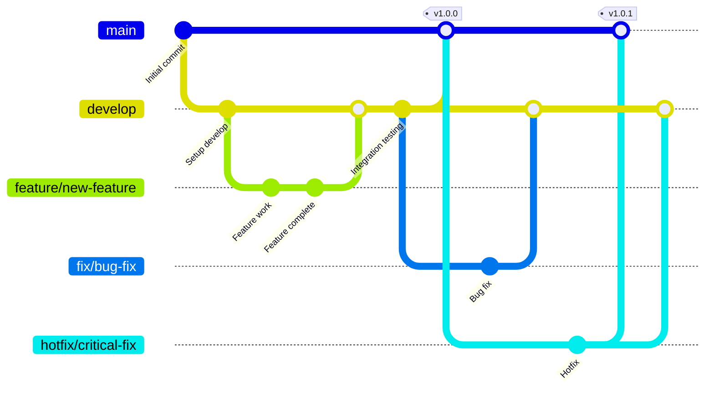
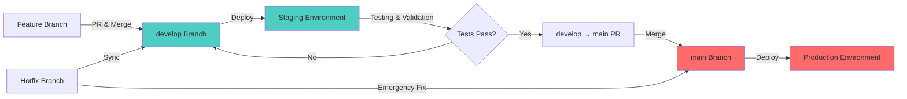

# Branching Strategy and Workflow

This document outlines the branching standards and workflow for this repository.

## Overview

This repository follows a **Git Flow-inspired branching model** with two primary branches: `main` and `develop`. This strategy ensures that production code is stable and that new features can be developed and tested in isolation before release.

## Branch Structure

### Primary Branches

#### `main` Branch
- **Purpose**: Production-ready code
- **Deployment**: All production deployments originate from this branch
- **Status**: Should always be in a deployable state
- **Updates**: Only receives merges from `develop` after thorough testing

#### `develop` Branch
- **Purpose**: Integration branch for features and fixes
- **Deployment**: Can be deployed to staging/test environments
- **Status**: Contains the latest development changes
- **Updates**: Receives merges from feature branches and bug fixes

### Supporting Branches

#### Feature Branches
- **Naming**: `feature/<feature-name>` or `feat/<feature-name>`
- **Purpose**: Develop new features
- **Branch from**: `develop`
- **Merge into**: `develop`
- **Lifetime**: Delete after merge

#### Bug Fix Branches
- **Naming**: `fix/<bug-description>` or `bugfix/<bug-description>`
- **Purpose**: Fix bugs in development
- **Branch from**: `develop`
- **Merge into**: `develop`
- **Lifetime**: Delete after merge

#### Hotfix Branches
- **Naming**: `hotfix/<issue-description>`
- **Purpose**: Fix critical production issues
- **Branch from**: `main`
- **Merge into**: Both `main` and `develop`
- **Lifetime**: Delete after merge

## Workflow Diagram



## Development Workflow

### Working on a New Feature

1. **Create a feature branch from `develop`**
   ```bash
   git checkout develop
   git pull origin develop
   git checkout -b feature/my-new-feature
   ```

2. **Develop your feature**
   - Make commits with clear, descriptive messages
   - Keep commits focused and atomic
   - Write tests for your changes

3. **Push your branch and create a Pull Request**
   ```bash
   git push origin feature/my-new-feature
   ```
   - Create a PR targeting `develop`
   - Fill out the PR template with relevant information
   - Request reviews from team members

4. **Address review feedback**
   - Make changes based on code review comments
   - Push additional commits to the same branch

5. **Merge after approval**
   - Ensure all CI checks pass
   - Merge the PR into `develop`
   - Delete the feature branch

### Releasing to Production

1. **Test on staging**
   - Deploy `develop` branch to staging environment
   - Perform thorough testing and validation
   - Fix any issues found and merge fixes into `develop`

2. **Create a release PR**
   - Create a PR from `develop` to `main`
   - Document changes in the PR description
   - Tag the merge commit with a version number

3. **Deploy to production**
   - After merging to `main`, deploy from `main` branch
   - Monitor the production deployment
   - Tag the release in GitHub with release notes

### Emergency Hotfixes

1. **Create hotfix branch from `main`**
   ```bash
   git checkout main
   git pull origin main
   git checkout -b hotfix/critical-bug-fix
   ```

2. **Fix the issue**
   - Make minimal changes to fix the critical issue
   - Test thoroughly

3. **Merge to both `main` and `develop`**
   ```bash
   # First to main
   git checkout main
   git merge hotfix/critical-bug-fix
   git push origin main
   
   # Then to develop
   git checkout develop
   git merge hotfix/critical-bug-fix
   git push origin develop
   ```

## Branch Protection and GitHub Settings

To enforce this branching strategy, it's recommended to enable branch protection rules for both `main` and `develop` branches.

### Recommended Protection Rules

#### For `main` Branch:
- ✅ Require pull request reviews before merging (at least 1-2 reviewers)
- ✅ Require status checks to pass before merging
- ✅ Require branches to be up to date before merging
- ✅ Require conversation resolution before merging
- ✅ Optionally: Require signed commits
- ✅ Optionally: Require linear history
- ✅ Do not allow bypassing the above settings

#### For `develop` Branch:
- ✅ Require pull request reviews before merging (at least 1 reviewer)
- ✅ Require status checks to pass before merging
- ✅ Require branches to be up to date before merging
- ✅ Allow force pushes (for maintainers only, if needed)

### Setting Up Branch Protection

To configure branch protection rules:

1. Go to your repository on GitHub
2. Navigate to **Settings** → **Branches**
3. Click **Add rule** under "Branch protection rules"
4. Enter the branch name pattern (e.g., `main` or `develop`)
5. Select the protection rules you want to enforce
6. Click **Create** or **Save changes**

### Additional Resources

- [About Protected Branches](https://docs.github.com/en/repositories/configuring-branches-and-merges/about-protected-branches)
- [Configuring Protected Branches](https://docs.github.com/en/repositories/configuring-branches-and-merges/configuring-protected-branches)
- [About Branch Protection Rules](https://docs.github.com/en/repositories/configuring-branches-and-merges-in-your-repository/managing-protected-branches/about-protected-branches)

## Environment Strategy



## Best Practices

1. **Keep branches short-lived**: Merge feature branches frequently to avoid large, complex merges
2. **Write descriptive commit messages**: Follow conventional commit format when possible
3. **Test before merging**: Ensure all tests pass and code is reviewed before merging
4. **Keep `main` stable**: Never commit directly to `main`; always use PRs
5. **Sync regularly**: Keep your branches up to date with `develop` to minimize conflicts
6. **Delete merged branches**: Clean up feature branches after they're merged
7. **Document breaking changes**: Clearly communicate any breaking changes in PRs and release notes
8. **Use semantic versioning**: Tag releases with semantic version numbers (e.g., v1.2.3)

## CI/CD Integration

All branches should be configured to run CI pipelines:

- **Feature/Fix branches**: Run tests and linting
- **`develop` branch**: Run tests, linting, and deploy to staging
- **`main` branch**: Run tests, linting, and deploy to production

Ensure that branch protection rules require passing CI checks before merging.

## Questions?

If you have questions about the branching strategy or workflow, please open an issue or contact the maintainers.
